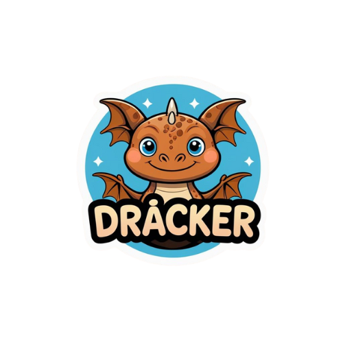

<div align="center">
  
  <h1>Dracker AdaptAI</h1>
  
  <p>
    <strong>A Inteligência Artificial a serviço da Educação Inclusiva e Criativa.</strong>
  </p>

  
  
  
  
</div>

<br />

**Dracker AdaptAI** é uma plataforma pedagógica inovadora que utiliza Inteligência Artificial Generativa para empoderar professores. Com o auxílio do mascote **Drácker**, o sistema cria materiais didáticos adaptados, lúdicos e interativos em segundos, permitindo que educadores foquem no que realmente importa: seus alunos.

---

## ✨ Funcionalidades Principais

<table>
  <tr>
    <td width="50%">
      <h3>📝 Criação Inteligente</h3>
      <ul>
        <li><strong>Quiz Educativo:</strong> Geração instantânea de perguntas de múltipla escolha com gabarito automático e distribuição aleatória de respostas.</li>
        <li><strong>Aprenda com o Drácker:</strong> Histórias narrativas personalizadas onde o dragão Drácker ensina o conteúdo, acompanhadas de atividades de fixação.</li>
        <li><strong>Música do Drácker:</strong> Transformação de conteúdos em músicas paródicas (estilo infantil anos 80) para facilitar a memorização, com exercícios de interpretação.</li>
        <li><strong>Caça-Palavras Master:</strong> Ferramenta completa para gerar caça-palavras temáticos com controle de direção, dificuldade e gabarito visual.</li>
      </ul>
    </td>
    <td width="50%">
      <h3>�️ Ferramentas & Acessibilidade</h3>
      <ul>
        <li><strong>Leitura em Voz Alta (TTS):</strong> Todo conteúdo gerado pode ser narrado, apoiando alunos não-leitores ou com deficiência visual.</li>
        <li><strong>Sistema de Abas:</strong> Trabalhe em múltiplas atividades simultaneamente sem perder o contexto.</li>
        <li><strong>Editor Visual:</strong> Refine o conteúdo gerado antes de finalizar.</li>
        <li><strong>Exportação Profissional:</strong> Baixe suas atividades em <strong>DOCX (Word)</strong> ou <strong>PDF</strong> formatado.</li>
        <li><strong>Backup Completo:</strong> Salve e restaure seu progresso via arquivo JSON.</li>
      </ul>
    </td>
  </tr>
</table>

## 🎨 Identidade & Design

O projeto adota uma identidade visual acolhedora e estimulante, fugindo dos padrões corporativos frios:

*   🟤 **Âmbar/Marrom (Terra):** Traz a sensação de livros clássicos, aventura e natureza, conectada ao personagem Drácker.
*   🔵 **Azul (Céu):** Representa clareza, ação e confiabilidade.
*   🐉 **Mascote Drácker:** Um guia amigável que torna a interface humanizada e divertida para crianças.

## 🚀 Como Executar

### Pré-requisitos
*   [Node.js](https://nodejs.org/) (v18+)
*   Chave de API do [Google AI Studio (Gemini)](https://aistudio.google.com/)

### Instalação

```bash
# 1. Clone o repositório
git clone https://github.com/binarymath/drackeradapta.git
cd drackeradapta

# 2. Instale as dependências
npm install

# 3. Inicie a aplicação
npm run dev
```

O sistema estará acessível em `http://localhost:5173`.

> **Nota:** Ao iniciar, acesse as configurações (ícone de engrenagem ou sidebar) e insira sua chave da API Gemini para habilitar as funções de IA.

## �️ Stack Tecnológica

*   **Core:** React 18, Vite
*   **Styling:** Tailwind CSS
*   **AI Integration:** Google Generative AI SDK (Gemini 2.5/2.0/1.5)
*   **State & Drag-n-Drop:** @dnd-kit
*   **Icons:** Lucide React
*   **Audio:** Web Speech API & Gemini Sound generation (experimental)

## 📄 Licença

Distribuído sob a licença MIT. Veja `LICENSE` para mais informações.

---
<div align="center">
  <sub>Desenvolvido com 💙 para a educação do futuro.</sub>
</div>
