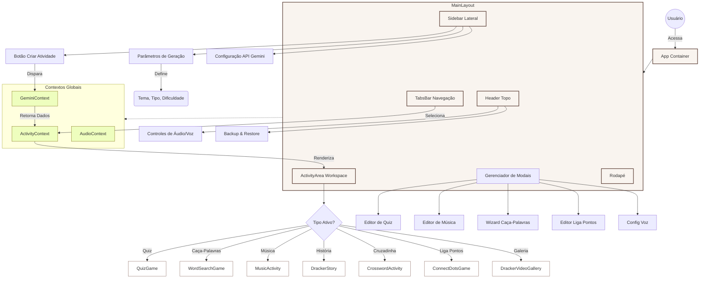

# Mapa da Arquitetura do Site (Sitemap Visual)

Como este projeto é uma **Single Page Application (SPA)** sem rotas de URL distintas (navegação baseada em estado), o Sitemap tradicional XML contém apenas a raiz.

Abaixo está o gráfico representativo da estrutura lógica e fluxo de navegação do aplicativo:

## Estrutura de Arquivos

- **public/**: `sitemap.xml` (Índice para motores de busca)
- **src/**: Código Fonte
  - **components/**: Componentes de UI e Atividades
  - **contexts/**: Gerenciamento de Estado
  - **services/**: Integração com Gemini AI
